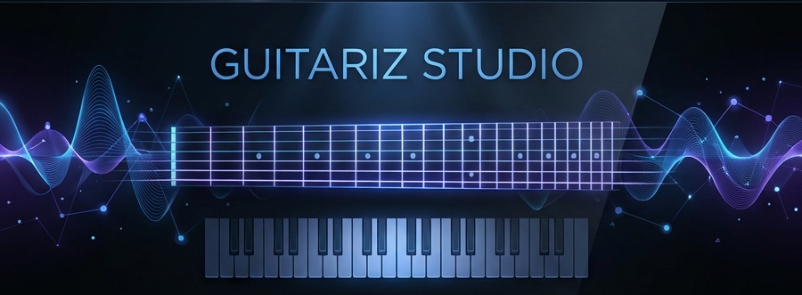
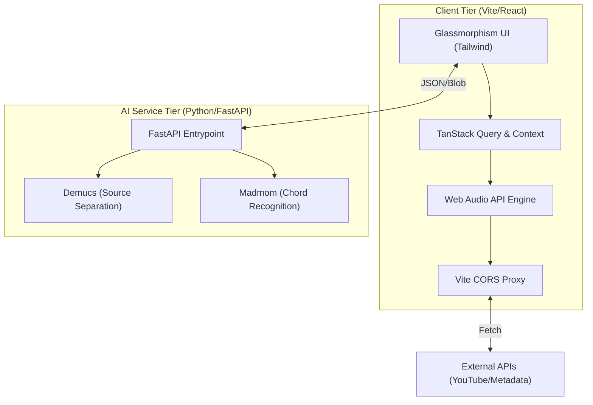

<div align="center">
  

  <br />

  <h1>🎸 Guitariz Studio</h1>
  <p><em>The Open Source Digital Workbench for Modern Musicians</em></p>

  <p align="center">
    
    
    
    
    
  </p>

  <p align="center">
    <a href="#-quick-start">Quick Start</a> •
    <a href="#-features">Features</a> •
    <a href="#-architecture">Architecture</a> •
    <a href="#-contributing">Contributing</a> •
    <a href="https://guitariz.studio">Live Studio</a>
  </p>
</div>

---

## 📖 Introduction

**Guitariz Studio** is a professional-grade, open-source music platform designed to bridge the gap between traditional theory and modern technology. It combines specific tools—like a low-latency instrument sandbox, AI-powered source separation, and gamified ear training—into a single, cohesive web application.

Whether you are a songwriter analyzing harmonies, a student mastering intervals, or a developer looking to contribute to the future of music tech, Guitariz provides the tools you need.

---

## 🌟 Features

### 🎧 Audio Intelligence & Tools

*   **Stem Splitter**: Isolate vocals, bass, drums, and other instruments from any track using industry-standard **Demucs** models.
*   **Smart Proxy System**: Built-in custom Vite proxy middleware to bypass CORS restrictions for seamless external API integration.
*   **Precision Tuner**: Advanced chromatic tuner with cent-level accuracy, suitable for Guitar, Bass, and Vocals.
*   **Chord AI**: Real-time harmonic analysis engine (YouTube integration currently Work in Progress).

### 🎮 Interactive Learning

*   **Ear Training Arcade**: Gamified modules to master **Intervals**, **Chord Identification**, and **Perfect Pitch**.
*   **Scale Explorer**: Comprehensive visualization of Western and Eastern scales across the circle of fifths.
*   **Virtual Fretboard & Piano**: 24-fret guitar and 88-key piano simulations with real-time interval mapping.

### 🛠️ Developer Experience

*   **PWA Support**: Fully installable as a native-like app on desktop and mobile.
*   **Dark Mode First**: sleek, "Deep Black" aesthetic optimized for creative environments.
*   **Modular Architecture**: Decoupled AI microservice and React frontend for scalable development.

---

## ⚡ Architecture

Guitariz uses a hybrid architecture to balance interactive performance with heavy AI computation.



---

## 📂 Project Structure

| Directory | Responsibility |
| :-- | :-- |
| `src/components/` | Reusable React components & UI Atomic units. |
| `src/hooks/` | Custom hooks for Audio Context & State Management. |
| `src/lib/` | Core logic for harmonic analysis and audio processing. |
| `src/pages/` | Main Application Views (Fretboard, Chord AI, etc). |
| `backend/` | Python-based AI microservice and ML models. |
| `public/` | Static assets, icons, and PWA manifests. |

---

## 🛠️ Tech Stack

*   **Frontend**: React 18, TypeScript 5.8, Vite 5
*   **State Management**: TanStack Query (React Query), React Context
*   **Styling**: Tailwind CSS 4, shadcn/ui, Framer Motion
*   **Audio Processing**: Web Audio API (Client), Librosa (Server)
*   **AI/ML**: Python, PyTorch, Meta Demucs, Madmom
*   **Testing**: Vitest, React Testing Library

---

## 🚀 Quick Start

### 1. Frontend Setup

Ensure you have Node.js 18+ and npm installed.

```bash
# Clone the repository
git clone https://github.com/abhi9vaidya/guitariz.git
cd guitariz

# Install dependencies
npm install

# Start Development Server
npm run dev
```

> **Note**: Create a `.env.local` file based on `.env.example` if you plan to connect to a local backend instance.

### 2. Backend Setup (Optional)

Required only for AI features like Stem Separation and Chord AI.

```bash
cd backend
python -m venv .venv

# Activate Virtual Environment
# Windows:
.venv\Scripts\activate
# MacOS/Linux:
source .venv/bin/activate

# Install Python dependencies
pip install -r requirements.txt

# Run the API Server
python main.py
```

---

## 🤝 Contributing

We welcome contributions from the community! Whether it's fixing a bug, adding a new scale, or improving the UI, your help is appreciated.

Please read our [**Contributing Guide**](CONTRIBUTING.md) for details on our code of conduct and the process for submitting pull requests.

1.  **Fork** the project.
2.  **Create** your feature branch (`git checkout -b feature/AmazingFeature`).
3.  **Commit** your changes (`git commit -m 'feat: Add AmazingFeature'`).
4.  **Push** to the branch (`git push origin feature/AmazingFeature`).
5.  **Open** a Pull Request.

---

## 🎖️ Acknowledgements & Credits

Guitariz Studio stands on the shoulders of giants in the music information retrieval (MIR) community. Special thanks to the authors of these pivotal libraries:

*   **[Librosa](https://librosa.org/)**: For providing the technical foundation for server-side audio analysis and feature extraction.
*   **[Madmom](https://github.com/CPJKU/madmom)**: For the high-level Hidden Markov Model implementations used in our Chord AI engine.
*   **[Meta Demucs](https://github.com/facebookresearch/demucs)**: For the state-of-the-art source separation models that power our Vocal Splitter.
*   **[Tonal.js](https://github.com/tonaljs/tonal)**: For providing the comprehensive harmonic matrix and interval logic on the client tier.

---

## 📜 License

Distributed under the **MIT License**. See `LICENSE` for more information.

<div align="center">
  <p><b>Guitariz Studio — Harmonizing Technology & Music.</b></p>
  <a href="https://github.com/abhi9vaidya">GitHub</a> • 
  <a href="https://guitariz.studio">Website</a> • 
  <a href="mailto:guitariz.studio@gmail.com">Contact</a>
</div>
